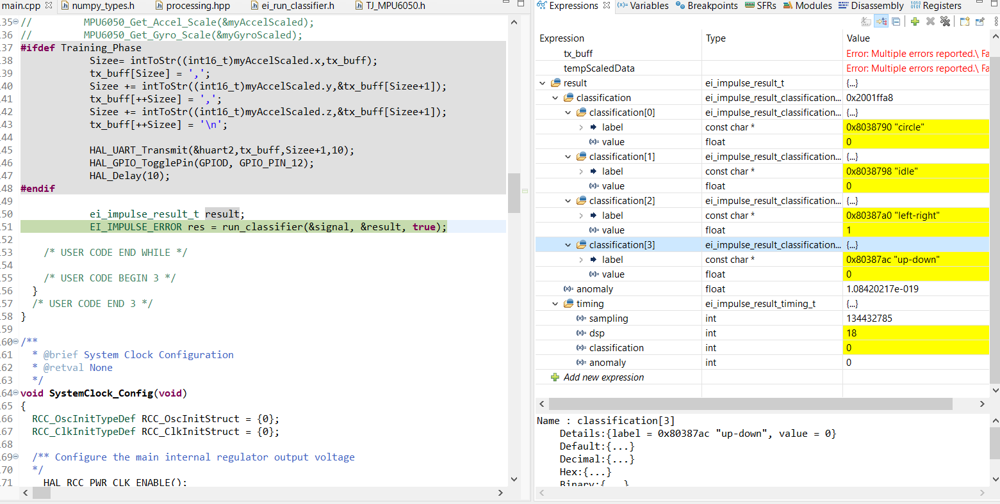
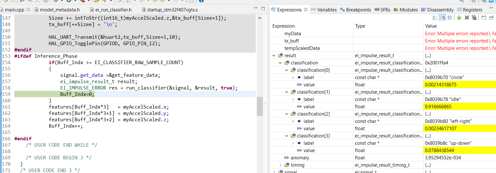
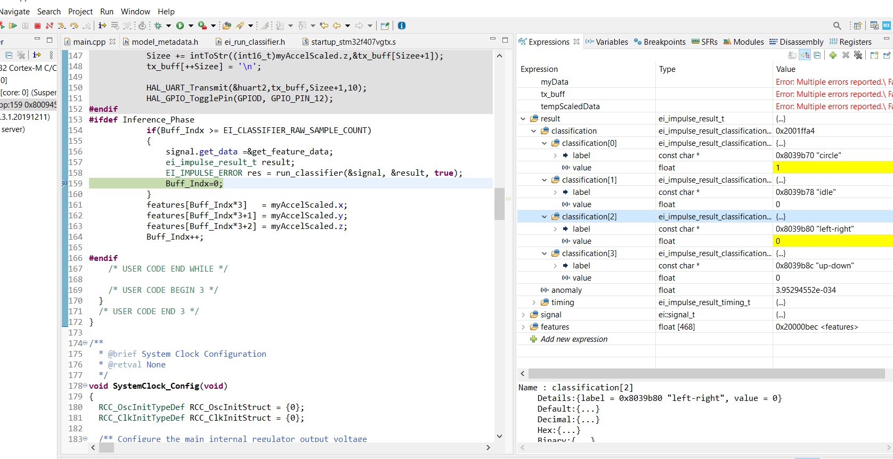

# STM32F407-tinyML-Edge_Impulse
This project was done during the Introduction to Embedded Machine Learning course in Coursera platform by Shawn Hymel as I decide to follow up with different hardware.
This project classifies 4 different motions using the NN classifier run on STM32F4 discovery.

Hardware used:
- stm32f4 discovery
- MPU6050(you can use the on-board MEMS sensor also!)
- USB to UART Converter (CP2102)

Connection:
- USART2 -> Tx on PA2 connected with Rx pin on USB to UART Converter
- I2C    -> SDA on PB7 with SDA on MPU6050
         -> SCL on PB6 with SCL on MPU6050
         
Follow this step to run on your hardware:
- 1- Go to my Edge impulse and clone the project -> https://studio.edgeimpulse.com/public/19276/latest
- 2- If you want to use the same hardware with the same collected data and with no Training_Phase 
   - A- Go to main.cpp in the "Private macro" section, choose Inference_Phase and flash the code in your STM32 
   - B- Make motion then see the result in the "result" variable
- 3- If you want to train with your own data (with the learning phase)
   - A- Go to main.cpp in the "Private macro" section, choose Training_Phase and flash the code in your STM32 
   - B- Connect your device to Edge Impulse using Data forwarder -> https://docs.edgeimpulse.com/docs/cli-data-forwarder 
      * See Installation first -> https://docs.edgeimpulse.com/docs/cli-installation
   - C- Collect your data, build the model, and finally the go-to Deployment page
   - D- Follow these steps -> https://docs.edgeimpulse.com/docs/using-cubeai
   - C- Go to main.cpp in the "Private macro" section, choose Inference_Phase and flash the code in your STM32
   - B- Make motion then see the result in the "result" variable
     
Some Screenshot of result during the Inference Phase:

